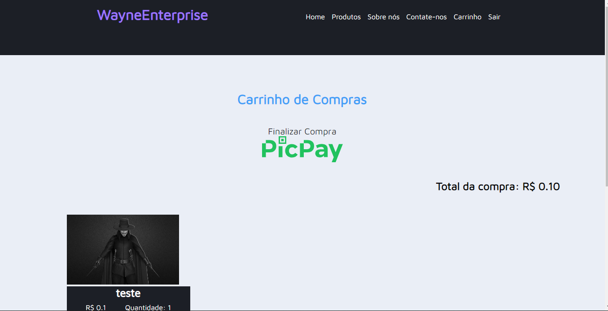

# ProjectWayneEnterprise

### Sobre o projeto

O projetos está sendo desenvolvido em PHP como meio de estudo, quando eu for fazendo as páginas vou postando aqui

### Tecnologias Utilizadas
 * PHP
 * HTML
 * CSS
 * MySQL (banco de dados)
 * Utilizo o xampp para rodar o projeto

### Link template FIGMA

https://www.figma.com/file/evQoNXmtxG9HB5oR6x6ErF/Project---Wayne-Enterprise

# Usuário
### Page Home

    

    

### Page About Us

    

### Page Contact Us

    

### Page Register

    

### Page Login

    

### Page List Products

    

    

    

### Page Shopping Cart

    

    

# Adm

### Page Index

    

### Page Home

    

    

### Page Add Product

    

### Page Edit Product

    

    

